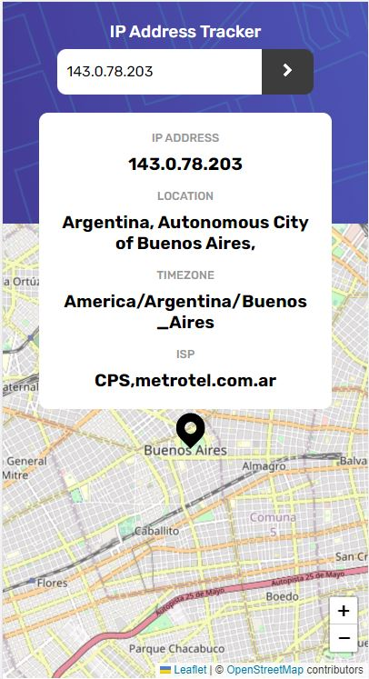

# Frontend Mentor - Calculator app solution

This is a solution to the [IP Address Tracker challenge on Frontend Mentor](https://www.frontendmentor.io/challenges/ip-address-tracker-I8-0yYAH0/hub).

## Table of contents

- [Overview](#overview)
  - [The challenge](#the-challenge)
  - [Screenshot](#screenshot)
  - [Links](#links)
- [My process](#my-process)
  - [Built with](#built-with)
  - [What I learned](#what-i-learned)
  - [Continued development](#continued-development)
  - [Useful resources](#useful-resources)
- [Author](#author)

## Overview

### The challenge

Your users should be able to:

- View the optimal layout for each page depending on their device's screen size
- See hover states for all interactive elements on the page
- See their own IP Address on the map on the initial page load
- Search for any IP addresses and see the key information and location

### Screenshot

### Links

- [GitHub Repo](https://github.com/mikhailkollen/react-ip-address-tracker-app)
- [Live Site URL](https://mikhailkollen.github.io/react-ip-address-tracker-app/)

## My process

### Built with

- React
- React-Leaflet
- CSS Flexbox
- CSS Grid

### What I learned

It was my first React project created from scratch. Although it was not obligatory to use React in this case, I decided to try it out. The challenge taught me how to use React-Leaflet, how to structure components and set up an application.

### Continued development

I am planning to apply my knowledge of React more and perhaps create a few more projects using React-Leaflet.

### Useful resources

- [Leaflet.js](https://leafletjs.com/)
- [React-Leaflet](https://react-leaflet.js.org/)
- [IPRegistryAPI](https://ipregistry.co/docs/endpoints)

## Author

- [GitHub](https://github.com/mikhailkollen)
- Frontend Mentor - [@mikhailkollen](https://www.frontendmentor.io/profile/mikhailkollen)
